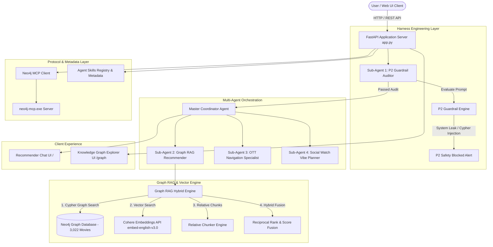
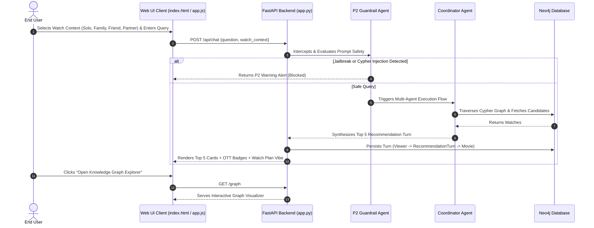
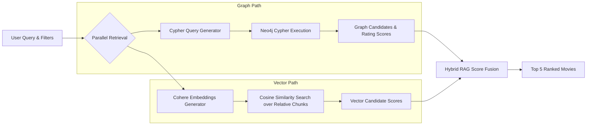
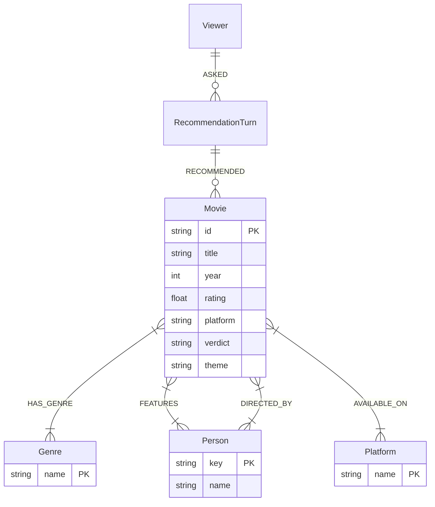

# 🍿 Moviemaxx System Architecture

Moviemaxx is an enterprise-grade, conversational Bollywood movie recommender powered by a **Multi-Agent Architecture**, **Neo4j Knowledge Graph (3,022 Movies)**, **Cohere Embeddings Graph RAG**, **P2 Harness Engineering Guardrails**, and **Model Context Protocol (MCP)** integration.

---

## 1. System Architecture

The overall system architecture follows a decoupled, multi-tiered pipeline:



---

## 2. User Architecture

The User Architecture governs how end-users interact with Moviemaxx across sessions:



### Key User Experience Components
1. **Watch Partner Context Selector**: Enables users to filter and boost recommendations tailored for `Solo Chill`, `Family Night`, `Friends Hangout`, or `Date Night / Partner`.
2. **Interactive Turn Memory**: Questions, extracted filters, answers, and recommended movie relationships are persisted as `Viewer -> RecommendationTurn -> Movie`. Follow-ups (e.g., *"Show me more like those"*) automatically inherit previous filters and exclude previously shown movie IDs.
3. **Dual-Mode Knowledge Graph Explorer (`/graph`)**: Interactive visual graph explorer for toggling between the **Movie Catalog Graph** and **System Metadata & Skills Graph**.

---

## 3. Graph RAG Architecture

Graph RAG combines structured Knowledge Graph Traversal with unstructured Vector Semantic Similarity Search:



### Mathematical Hybrid Score Formula

$$\text{Hybrid Score} = \left(0.5 \times \text{Graph Score}\right) + \left(0.5 \times \text{Vector Similarity}\right)$$

Where:
- $\text{Graph Score} = \left(0.6 \times \text{Normalized Rank}\right) + \left(0.4 \times \frac{\text{IMDb Rating}}{10}\right)$
- $\text{Vector Similarity} = \text{CosineSimilarity}\left(\vec{V}_{\text{query}}, \vec{V}_{\text{chunk}}\right)$ via Cohere `embed-english-v3.0`.

---

## 4. Neo4j Working Architecture & Application Usage

### How Neo4j is Used in Moviemaxx

Neo4j is the central source of truth and graph database for Moviemaxx, managing **3,022 Bollywood Movies** and their complex entity relationships.



### Neo4j Execution Mechanisms

1. **Idempotent Batch Ingestion**:
   Uses `UNWIND $rows AS row` batch queries with database constraints (`movie_id`, `genre_name`, `person_key`, `platform_name`) to merge node properties and relationships atomically.

2. **Graph Traversal Queries (`search_movies`)**:
   Executes optimized multi-hop Cypher traversals:
   ```cypher
   MATCH (movie:Movie)
   OPTIONAL MATCH (movie)-[:HAS_GENRE]->(genre:Genre)
   OPTIONAL MATCH (movie)-[:FEATURES]->(actor:Person)
   OPTIONAL MATCH (movie)-[:DIRECTED_BY]->(director:Person)
   WITH movie,
        collect(DISTINCT genre.name) AS genres,
        collect(DISTINCT actor.name) AS cast,
        collect(DISTINCT director.name)[0] AS director
   WHERE (size($genres) = 0 OR any(item IN genres WHERE toLower(item) IN [g IN $genres | toLower(g)]))
     AND ($year IS NULL OR movie.year = $year)
     AND ($minimum_rating IS NULL OR movie.rating >= $minimum_rating)
   RETURN movie.id AS id, movie.title AS title, movie.year AS year, movie.rating AS rating, genres, cast, director
   ORDER BY coalesce(movie.rating, 0) DESC
   LIMIT $limit
   ```

3. **Conversational Turn Memory**:
   Persists turns into Neo4j graph:
   ```cypher
   MERGE (viewer:Viewer {id: 'moviemaxx-demo-viewer'})
   CREATE (turn:RecommendationTurn {id: $turn_id, question: $question, answer: $answer, filtersJson: $json, createdAt: datetime()})
   CREATE (viewer)-[:ASKED]->(turn)
   WITH turn
   UNWIND $recommendations AS rec
   MATCH (movie:Movie {id: rec.id})
   CREATE (turn)-[:RECOMMENDED {rank: rec.rank}]->(movie)
   ```

4. **Model Context Protocol (MCP) Server Integration**:
   Connects to `neo4j-mcp.exe` via stdio JSON-RPC, enabling AI assistants and MCP clients to run `get-schema`, `read-cypher`, and `write-cypher` commands over the graph.

---

## 5. Procedural Architecture & Workflow Execution

The Procedural Architecture defines step-by-step execution workflows across Moviemaxx subsystems:

```mermaid
flowchart TD
    subgraph Procedure 1: Catalog Import & Graph Setup
        P1_Start([Trigger Ingest]) --> P1_CSV[Read CSV & Expanded 3,022 Dataset]
        P1_CSV --> P1_Normalize[Normalize Attributes & Apply Genre Overrides]
        P1_Normalize --> P1_Constraints[Apply Neo4j Constraints]
        P1_Constraints --> P1_Batch[Write Batches UNWIND $rows]
        P1_Batch --> P1_End([Graph Built & Ready])
    end

    subgraph Procedure 2: Graph RAG Vector Indexing
        P2_Start([Initialize RAG]) --> P2_Load[Load Movie Records]
        P2_Load --> P2_Chunk[Relative Chunker OVERVIEW, CAST_ROLE, THEME_VERDICT]
        P2_Chunk --> P2_Embed[Generate Cohere Embeddings embed-english-v3.0]
        P2_Embed --> P2_Index([Vector Store Index Ready])
    end

    subgraph Procedure 3: Multi-Agent Query Processing
        P3_Start([User Query Received]) --> P3_Guard[GuardrailAgent Audit]
        P3_Guard -->|Unsafe| P3_Block[Return P2 Alert]
        P3_Guard -->|Safe| P3_Rec[RecommenderAgent Hybrid Graph RAG Search]
        P3_Rec --> P3_Stream[StreamingAgent OTT Platform Lookup]
        P3_Stream --> P3_Plan[WatchPlannerAgent Context Vibe Adaptation]
        P3_Plan --> P3_Coord[CoordinatorAgent Response Synthesis]
        P3_Coord --> P3_Save[Save Turn to Neo4j Graph]
        P3_Save --> P3_End([Return Top 5 Cards + Vibe])
    end

    subgraph Procedure 4: MCP Protocol Tool Call
        P4_Start([MCP Client Tool Call]) --> P4_Tool{Tool Name}
        P4_Tool -->|get-schema| P4_Schema[Introspect Labels & Relationships]
        P4_Tool -->|read-cypher| P4_Read[Execute Read-Only Cypher Query]
        P4_Tool -->|write-cypher| P4_Write{NEO4J_MCP_READ_ONLY?}
        P4_Write -->|True| P4_Denied[Return Blocked Error]
        P4_Write -->|False| P4_Exec[Execute Write Transaction]
    end
```


