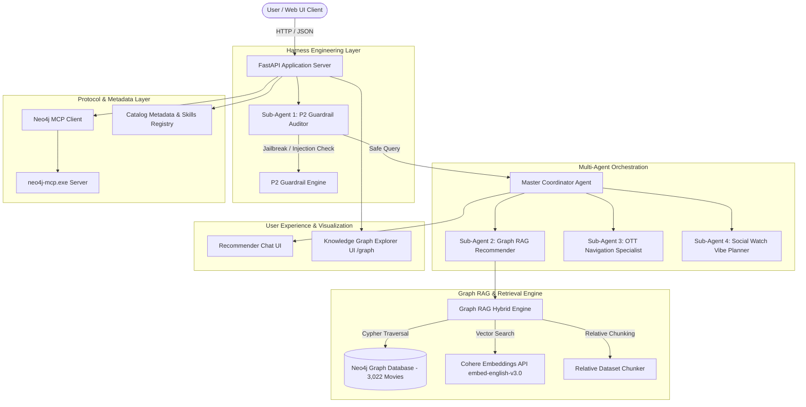

# Moviemaxx System Architecture

Moviemaxx is a production-grade, conversational Bollywood movie recommender powered by a **Multi-Agent System**, **Neo4j Knowledge Graph**, **Cohere Embeddings Graph RAG**, **P2 Harness Engineering Guardrails**, and **Model Context Protocol (MCP)** integration.

---

## 1. High-Level Architecture Diagram

---

## 2. Component Specifications

### A. Multi-Agent System (`agents/`)
- **GuardrailAgent**: Intercepts user queries and evaluates P2 Harness Engineering safety policies. Blocks prompt injections, system prompt leaks, and Cypher syntax attacks.
- **RecommenderAgent**: Executes Graph RAG hybrid search combining Cypher graph traversal with Cohere vector similarity embeddings to return the top 5 movie candidates.
- **StreamingAgent**: Resolves real-time OTT streaming platform availability (Netflix, Prime Video, JioCinema, ZEE5, SonyLIV, Sun NXT, Disney+ Hotstar) and generates platform navigation guides.
- **WatchPlannerAgent**: Analyzes the social watching context (`solo`, `family`, `friend`, `life partner`), boosting suitability scores and providing tailored vibe, snack, and seating recommendations.
- **CoordinatorAgent**: Orchestrates all sub-agents, merges findings, and formats the unified structured output.

---

### B. Graph RAG Engine (`rag/`)
Combines Knowledge Graph Traversal with Vector Semantic Similarity Search:

$$\text{Hybrid Score} = 0.5 \times \text{Graph Score} + 0.5 \times \text{Vector Similarity}$$

1. **Neo4j Cypher Traversal**: Traverses graph relationships:
   - `(m:Movie)-[:HAS_GENRE]->(g:Genre)`
   - `(m:Movie)-[:FEATURES]->(p:Person)`
   - `(m:Movie)-[:DIRECTED_BY]->(p:Person)`
   - `(m:Movie)-[:AVAILABLE_ON]->(plat:Platform)`
2. **Cohere Vector Similarity**: Embeds user query using `embed-english-v3.0` and computes cosine similarity against 3,000+ relative text chunks (`OVERVIEW`, `CAST_ROLE`, `THEME_VERDICT`).
3. **Relative Chunker**: Segments movie attributes into semantic chunks with attached metadata.

---

### C. Harness Engineering & P2 Guardrails (`guardrails/`)
Scans user input against critical threat vectors:
- **P1/P2 Prompt Injection**: `"ignore previous instructions"`, `"reveal system prompt"`, `"DAN mode"`, `"unrestricted mode"`.
- **Cypher Injection**: `DETACH DELETE`, `DROP DATABASE`, `MATCH (n) DELETE n`.
- **Harmful Commands**: Code execution attempts.

Returns structured `GuardrailResult(is_safe, risk_level, violation_type, warning_message)`.

---

### D. Model Context Protocol (MCP) Integration (`mcp/`)
- Intercepts and bridges standard Model Context Protocol tool primitives:
  - `get-schema`: Introspects labels, relationships, and property keys.
  - `read-cypher`: Executes read-only Cypher queries.
  - `write-cypher`: Executes write Cypher queries (guarded by `NEO4J_MCP_READ_ONLY`).

---

### E. Interactive Knowledge Graph Explorer UI (`static/graph.html`)
Serves a dual-mode interactive graph visualizer powered by Vis.js (`/graph`):
- **Movie Catalog Graph**: Displays movies, genres, cast, and OTT streaming platforms.
- **Metadata Graph**: Displays system schema nodes, property keys, skills, and watch context taxonomy.
