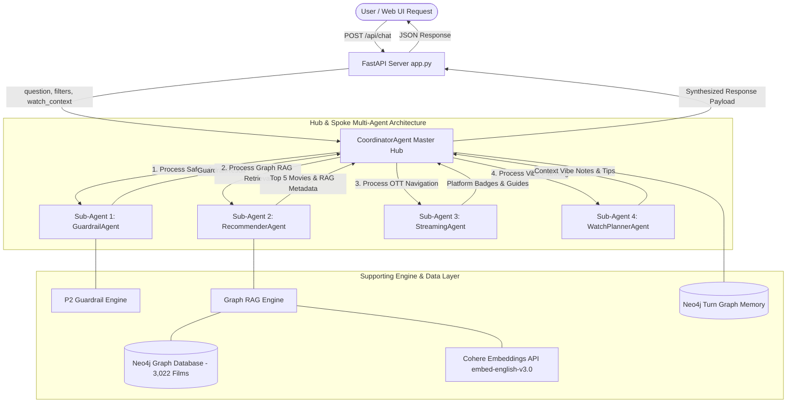
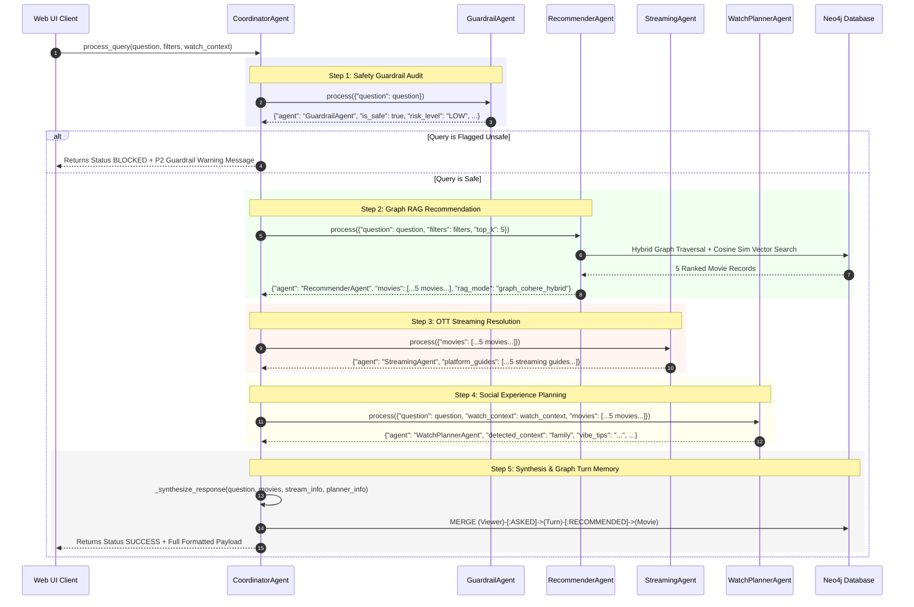
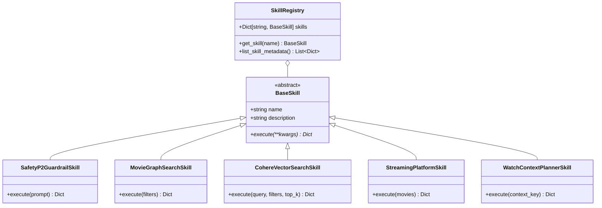
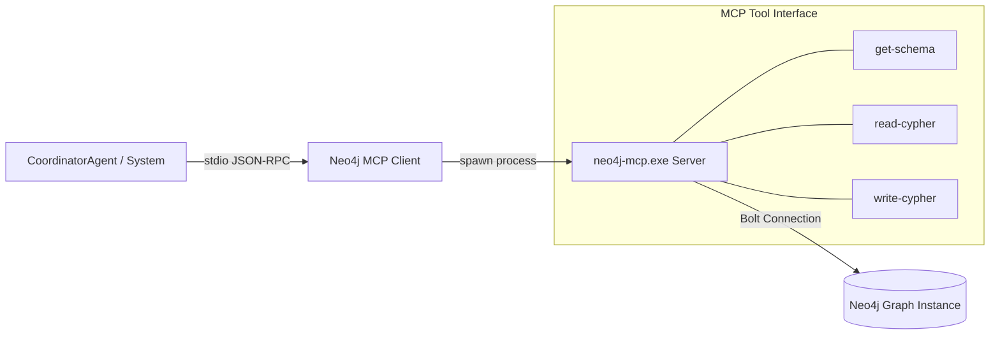

# 🤖 Moviemaxx Multi-Agent Architecture & Protocol Specification

Moviemaxx uses a **Specialized Multi-Agent Architecture** designed to deliver enterprise-grade, conversational Bollywood movie intelligence. Instead of relying on a single monolithic prompt, Moviemaxx decomposes movie recommendation into a collaborative network of autonomous sub-agents coordinated by a central orchestrator.

---

## 1. Multi-Agent Usecase & Rationale

### Why a Multi-Agent Architecture?
Movie recommendation in Moviemaxx involves multiple distinct domains of intelligence:
1. **Safety & Security**: Protecting against prompt injections, jailbreaks, and Cypher syntax leaks.
2. **Knowledge Retrieval**: Hybrid Graph RAG combining Neo4j graph traversal with Cohere vector similarity search over 3,022 Bollywood movies.
3. **OTT Platform Navigation**: Identifying streaming availability across platforms (Netflix, Prime Video, JioCinema, Hotstar, ZEE5, SonyLIV, Sun NXT).
4. **Social Experience Planning**: Tailoring recommendations based on who the user is watching with (`solo`, `family`, `friend`, `life partner`).

By separating these concerns into specialized agents, Moviemaxx guarantees:
- **Modularity**: Individual agents can be updated, benchmarked, or swapped independently.
- **Security Isolation**: Guardrails execute **before** any database traversal or LLM reasoning occurs.
- **Determinism & Precision**: Domain-specific logic (e.g., streaming platform resolution and social context vibe planning) is handled deterministically without relying solely on LLM hallucinations.

---

## 2. Multi-Agent Topology & Communication Architecture

Moviemaxx implements an **Orchestrated Hub-and-Spoke Multi-Agent Pattern**. The `CoordinatorAgent` acts as the hub orchestrator, while `GuardrailAgent`, `RecommenderAgent`, `StreamingAgent`, and `WatchPlannerAgent` act as domain-specific spokes.



---

## 3. Agent Specifications & Roles

| Agent Name | Role | Primary Responsibility | Backing Engine / Skill |
| :--- | :--- | :--- | :--- |
| 🛡️ **`GuardrailAgent`** | Safety & Harness Engineering Auditor | Intercepts user prompt; evaluates jailbreak, prompt injection, and Cypher leak threats. | `P2GuardrailEngine`, `SafetyP2GuardrailSkill` |
| 🎬 **`RecommenderAgent`** | Top-5 Graph RAG Recommender | Performs hybrid graph traversal + Cohere vector similarity search to find top 5 movies. | `GraphRAGEngine`, `MovieGraphSearchSkill`, `CohereVectorSearchSkill` |
| 🍿 **`StreamingAgent`** | OTT Platform Navigation Specialist | Maps movie metadata to streaming availability badges and viewing navigation instructions. | `StreamingPlatformSkill` |
| 👨‍👩‍👧‍👦 **`WatchPlannerAgent`** | Social Experience & Vibe Planner | Analyzes user social intent (`family`, `solo`, `friend`, `life partner`) and generates vibe tips. | `WATCH_CONTEXT_TAXONOMY`, `WatchContextPlannerSkill` |
| ✳ **`CoordinatorAgent`** | Master Orchestrator | Controls multi-agent execution pipeline, short-circuits unsafe queries, and synthesizes final response. | Python Class Composition, Neo4j Driver |

---

## 4. Agent-to-Agent Communication Protocol & Data Contracts

Agents communicate using a **Synchronous In-Memory Message Protocol** built on Python dictionary contracts (`Dict[str, Any]`). Each agent inherits from `BaseAgent` and implements the `process(input_data: Dict[str, Any]) -> Dict[str, Any]` interface.

### Message Flow Sequence Diagram



---

## 5. Detailed Input & Output Payload Schemas

### 1. `GuardrailAgent` Contract
- **Input Payload**:
  ```json
  {
    "question": "Recommend 5 top-rated action thrillers on Netflix for family night"
  }
  ```
- **Output Payload**:
  ```json
  {
    "agent": "GuardrailAgent",
    "is_safe": true,
    "risk_level": "LOW",
    "violation_type": "NONE",
    "warning_message": "",
    "sanitized_prompt": "Recommend 5 top-rated action thrillers on Netflix for family night"
  }
  ```

### 2. `RecommenderAgent` Contract
- **Input Payload**:
  ```json
  {
    "question": "Recommend 5 top-rated action thrillers on Netflix for family night",
    "filters": {
      "genre": "Action",
      "platform": "Netflix",
      "minimum_rating": 6.0
    },
    "top_k": 5
  }
  ```
- **Output Payload**:
  ```json
  {
    "agent": "RecommenderAgent",
    "recommended_count": 5,
    "movies": [
      {
        "id": "fighter-2024",
        "title": "Fighter",
        "year": 2024,
        "rating": 7.1,
        "platform": "Netflix",
        "genres": ["Action", "Coming-of-Age", "Social"],
        "director": "Siddharth Anand",
        "cast": ["Hrithik Roshan", "Deepika Padukone"],
        "graph_rag_score": 0.44
      }
    ],
    "rag_mode": "graph_cohere_hybrid"
  }
  ```

### 3. `StreamingAgent` Contract
- **Input Payload**:
  ```json
  {
    "movies": [ {"title": "Fighter", "platform": "Netflix", "year": 2024} ]
  }
  ```
- **Output Payload**:
  ```json
  {
    "agent": "StreamingAgent",
    "platform_guides": [
      {
        "movie_title": "Fighter",
        "platform": "Netflix",
        "status": "Available Streaming",
        "badge": "🍿 Available on Netflix",
        "navigation_note": "Search 'Fighter' on Netflix app or website."
      }
    ]
  }
  ```

### 4. `WatchPlannerAgent` Contract
- **Input Payload**:
  ```json
  {
    "question": "Recommend 5 top-rated action thrillers on Netflix for family night",
    "watch_context": "family",
    "movies": [ {"title": "Fighter", "certificate": "UA", "genres": ["Action"]} ]
  }
  ```
- **Output Payload**:
  ```json
  {
    "agent": "WatchPlannerAgent",
    "detected_context": "family",
    "context_label": "Family Movie Night",
    "context_description": "Wholesome, multi-generational films suitable for all age groups.",
    "vibe_tips": "Prepare popcorn, gather around the main TV, suitable for all ages.",
    "movie_context_notes": [
      {
        "movie_title": "Fighter",
        "context_suitability": "Great for Family Viewing! Wholesome entertainment.",
        "certificate": "UA"
      }
    ]
  }
  ```

---

## 6. Executable Agent Skills Registry

Agents perform operations by executing reusable units of functionality called **Agent Skills**. The `SkillRegistry` manages and exposes these skills:



1. **`SafetyP2GuardrailSkill`**: Executes `P2GuardrailEngine.evaluate(prompt)`.
2. **`MovieGraphSearchSkill`**: Runs Cypher graph queries via `search_movies(database, filters)`.
3. **`CohereVectorSearchSkill`**: Invokes `GraphRAGEngine.hybrid_recommend(...)` to compute cosine similarity over Cohere embeddings.
4. **`StreamingPlatformSkill`**: Maps platform names to OTT badges and navigation instructions.
5. **`WatchContextPlannerSkill`**: Maps social watch context keys to `WATCH_CONTEXT_TAXONOMY` definitions.

---

## 7. Model Context Protocol (MCP) Integration

Moviemaxx incorporates the **Model Context Protocol (MCP)** via `mcp/neo4j_mcp_client.py` and the `neo4j-mcp.exe` stdio server.



- **Read-Only Mode Enforcement**: `NEO4J_MCP_READ_ONLY=true` prevents unauthorized graph mutations over the MCP server protocol.
- **Introspection**: AI assistants and external agent clients use `get-schema` to introspect labels (`Movie`, `Genre`, `Person`, `Platform`), property types, and graph relationships dynamically.

---

## 8. Failure Modes & Error Recovery Protocols

| Failure Scenario | Detecting Agent | Mitigation / Fallback Protocol |
| :--- | :--- | :--- |
| **Prompt Injection / Cypher Injection** | `GuardrailAgent` | Query execution is **short-circuited**. Returns HTTP status code `200` with `status: "BLOCKED"` and safety warning alert without touching Neo4j. |
| **Cohere API Rate Limit (HTTP 429)** | `RecommenderAgent` / `GraphRAGEngine` | Automatically falls back to deterministic SHA-256 seed vector generation. Application continues operating seamlessly. |
| **No Graph Matches Found** | `RecommenderAgent` | `CoordinatorAgent` catches empty movie array and returns friendly guidance prompting user to broaden search criteria (e.g., lower rating threshold or expand genres). |
| **Missing OTT Streaming Metadata** | `StreamingAgent` | Generates a fallback guide badge: `"🎟️ Available via Digital Purchase/Rental or Satellite TV"` with instructions to search YouTube Movies or TV broadcasts. |

---

## 9. Verification & Testing of Multi-Agent System

The entire multi-agent interaction is tested via unit and integration suites in `tests/`:
- `test_agent.py`: Validates `MovieQuestionTests` filter extraction, follow-up memory exclusion, and catalog overrides.
- `test_system.py`: Tests `GuardrailAgent` blocking jailbreaks, `WatchPlannerAgent` detecting social contexts, `CohereEmbedder` fallbacks, and `MCPClient` initialization.
- `test_api_endpoints.py`: Validates end-to-end multi-agent execution via `POST /api/chat`.

To run the complete test suite:
```powershell
python -m unittest discover -s tests -v
```
