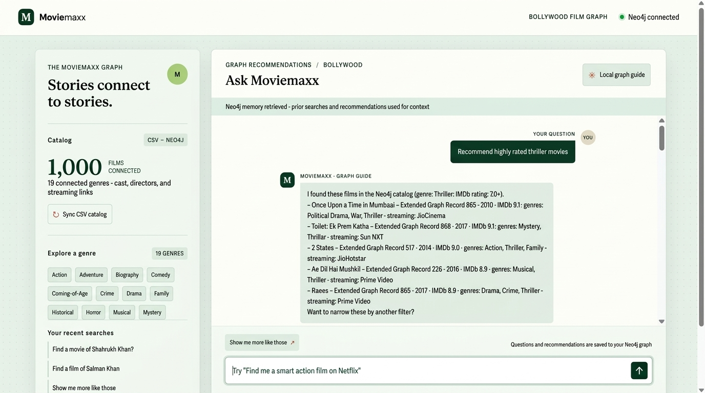

# 🍿 Moviemaxx PRO 2.0 | Multi-Agent Movie Graph & Graph RAG Recommender

Moviemaxx is a state-of-the-art conversational Bollywood movie recommendation engine powered by a **Multi-Agent System**, **Neo4j Knowledge Graph (3,022 Movies)**, **Cohere Embeddings Graph RAG**, **P2 Harness Engineering Guardrails**, and **Model Context Protocol (MCP)** integration.

---

## 📸 Screenshots

### 1. Multi-Agent Recommender & Social Watch Planner UI


### 2. Interactive Knowledge Graph Explorer UI (`/graph`)


### 3. Movie Graph Overview


---

## ✨ Key Features

1. **3,022 Bollywood Movie Knowledge Graph**: Connected nodes for `Movie`, `Genre`, `Person` (Cast & Directors), `Platform` (OTT services), `Viewer`, and `RecommendationTurn`.
2. **Multi-Agent System**:
   - 🛡️ **GuardrailAgent**: Audits prompts against P2 Harness Engineering safety rules (jailbreak defense, Cypher injection protection).
   - 🎬 **RecommenderAgent**: Hybrid Graph RAG recommender returning top 5 candidate movies.
   - 🍿 **StreamingAgent**: OTT platform navigation specialist (Netflix, Prime Video, JioCinema, ZEE5, SonyLIV, Sun NXT, Disney+ Hotstar).
   - 👨‍👩‍👧‍👦 **WatchPlannerAgent**: Social experience planner (`solo`, `family`, `friend`, `life partner`).
   - ✳ **CoordinatorAgent**: Master multi-agent orchestrator.
3. **Graph RAG Hybrid Fusion**: Combines Neo4j Cypher Graph Traversal with Cohere API `embed-english-v3.0` vector similarity over 3,000+ relative text dataset chunks.
4. **Interactive Knowledge Graph Explorer (`/graph`)**: Web page for visual graph exploration with dual tabs: **Movie Catalog Graph** and **Metadata & Skills Graph**.
5. **FastAPI OpenAPI Diagnostic Test Suite (`/docs`)**: In-browser API tests for Neo4j, Groq LLM, Cohere Embeddings, and Vector Search index.
6. **Data Explainability & Provenance**: Quantitative hybrid score breakdown ($0\text{--}100\%$) and graph relationship lineage (`HAS_GENRE`, `FEATURES`, `AVAILABLE_ON`).
7. **Logging System**: Structured logging to `logs/moviemaxx.log` (ignored by Git).

---

## 🏗️ Architecture & Documentation Links

- 📐 **[ARCHITECTURE.md](ARCHITECTURE.md)** — Detailed multi-agent system design, Graph RAG pipeline formulas, and MCP protocol architecture.
- 🔍 **[DATA_EXPLAINABILITY.md](DATA_EXPLAINABILITY.md)** — Knowledge graph node schemas, data provenance, scoring breakdown, and conversational memory lineage.
- 🛠️ **[PROCEDURES.md](PROCEDURES.md)** — Setup guide, catalog re-syncing procedure, test execution, and deployment instructions.
- 🧩 **[SKILLS.md](SKILLS.md)** — Catalog of executable agent skills and API metadata definitions.

---

## 🚀 Quickstart Guide

### 1. Installation & Environment

```powershell
python -m venv .venv
.venv\Scripts\Activate.ps1
python -m pip install -r requirements.txt
```

### 2. Configure Credentials (`.env`)

Edit your `.env` file:

```dotenv
NEO4J_URI="neo4j+s://your-instance.databases.neo4j.io"
NEO4J_USERNAME="neo4j"
NEO4J_PASSWORD="your-password"
NEO4J_DATABASE="neo4j"

GROQ_API_KEY="your-groq-api-key"
GROQ_MODEL="llama-3.3-70b-versatile"

COHERE_API_KEY="your-cohere-api-key"
COHERE_EMBED_MODEL="embed-english-v3.0"
```

### 3. Launch Server & Re-Sync Catalog

Launch the FastAPI application:

```powershell
python -m uvicorn app:app --reload --port 8000
```

- **Recommender Web UI**: `http://127.0.0.1:8000`
- **Knowledge Graph Explorer UI**: `http://127.0.0.1:8000/graph`
- **FastAPI OpenAPI Docs**: `http://127.0.0.1:8000/docs`

Click **"↻ Sync CSV & RAG Index"** in the sidebar or send `POST /api/import` to ingest all 3,022 movies into Neo4j!

---

## 🧪 Running Unit & Integration Tests

Run the complete 23-test diagnostic suite:

```powershell
python -m unittest discover -s tests -v
```
